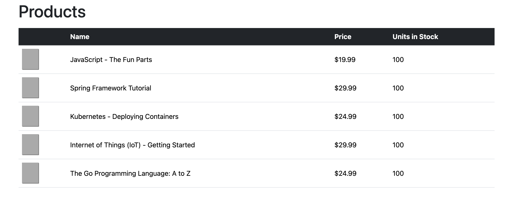
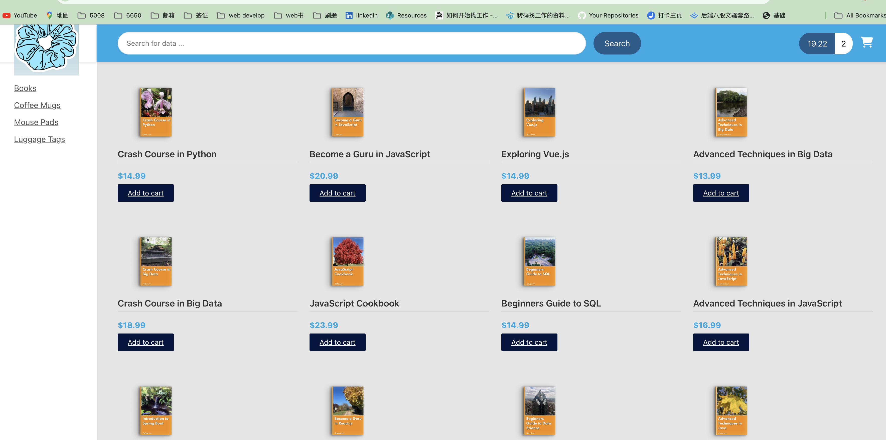
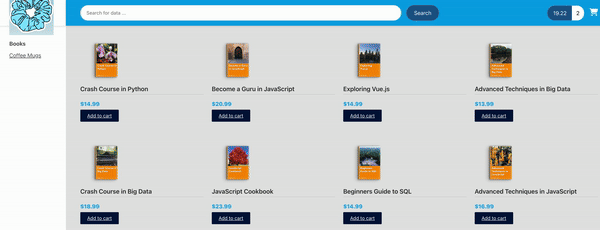

# E-commerce 1.0

# E-Commerce release 2.0

## Online Shop Template Integration

Html + css file integration with Angular

## Search for products by category

make left navigation bar working according to category show products

 

### Angular routing

in angular, you can add link which will route to other components in application and update a section of the page instead of whole page.

1.Define Routes

2.configure router based on routes

3.define the router outlet

4.setup router links to pass category id param

5.enhance productListComponent to read category id param

* activatedRoute is injected which is useful for accessing route parameters
* update product list service

6.modify spring boot app, RESR repository needs new method for a given category id

7.update angular service to call new url on spring boot app

## Search products by category(dynamic)

1.modify spring boot - expose entity ids

2.create a class: productCategory

3.create new component for menu

4.menu component to read data from product service

5.update product service to call URL on Spring Boot app

6.in HTML, replace hard-coded links with menu component

