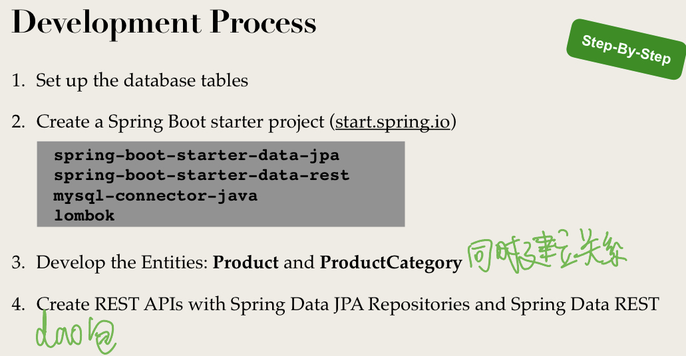
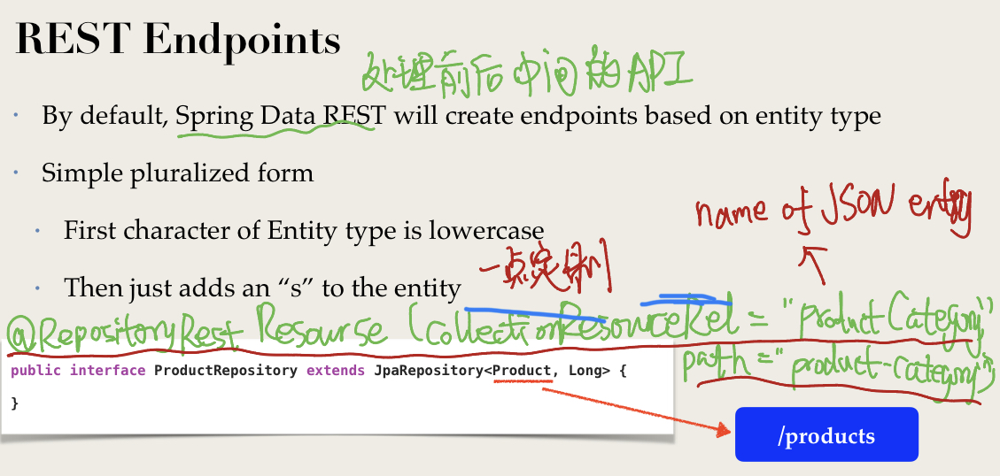
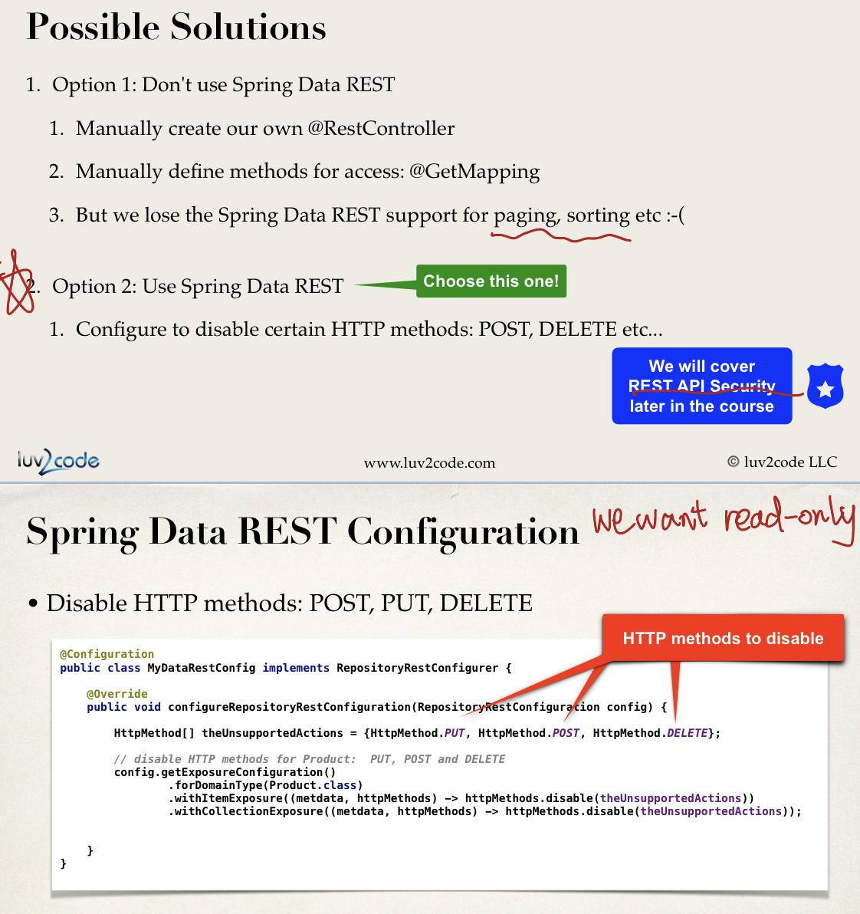

# SET UP backend

4. using spring data jpa will automatically create endpoints for our entity.
   * we have get, put, delete, update, patch(更新一部分) methods.

however, we want to restrict user, they can only access some behavior like get. the others are forbidden.

