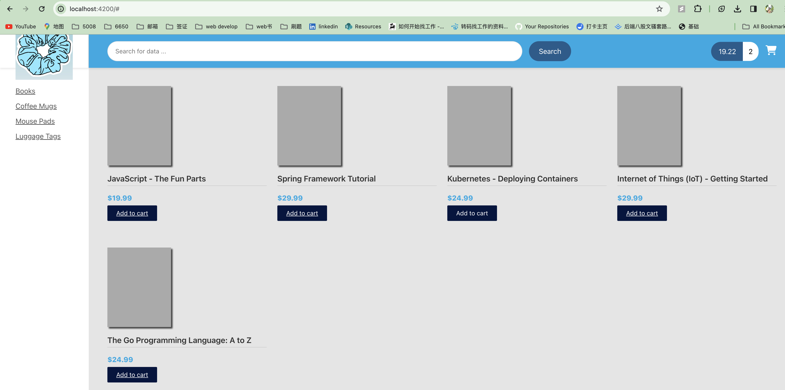

# E-commerce 1.0

# E-Commerce release 2.0

## Online Shop Template Integration

Html + css file integration with Angular

## Search for products by category

make left category working

### Angular routing

in angular, you can add link which will route to other components in application and update a section of the page instead of whole page.

1.Define Routes

2.configure router based on routes

3.define the router outlet

4.setup router links to pass category id param

